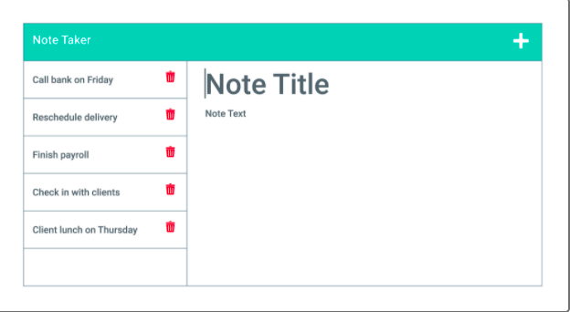
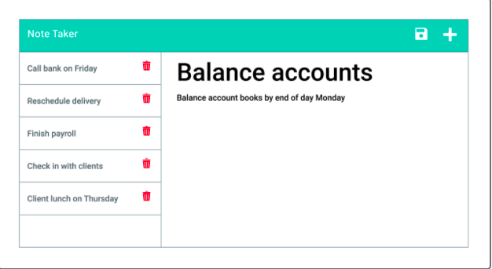

 
   

  
  

  
  # Note-Taker

  
  
   
   
  
  
  
  
  
  

   
  

By Julian Wilson
   
   

  

    
  

  
   
     
   

  
  

  
Table of Contents

  
  - [About](#about)
  - [Built With](#built-with)
  - [Author](#Author)
  
  
  
  
   
     
   

  
  ## 
  About 

  ---
  

   
  This application is made to for the user to create notes and save them to be able to access at a later time or whenever they may need.

 

   
   

  

  

  
  

     
Screenshot and Demo

    
  
   
   
   
   
   
   

  

 

please take a look at the walkthrough video demonstrating the functionality of the application. <a href= "https://www.awesomescreenshot.com/video/5565702?key=f2aa37235c1857afa58b172a30d1ad70">click here</a>

  

  
   
   
   
   
  
  
  # Built With
  

   

> - <a href="https://www.w3schools.com/css/">CSS</a>
> - <a href="https://www.w3schools.com/html/">HTML</a>
> - <a href="https://nodejs.org/en/">Node</a>
> - <a href="https://www.tutorialspoint.com/nodejs/nodejs_express_framework.htm">Express</a>
> - <a href="https://www.w3schools.com/js/js_es6.asp">ES6</a>
>
> - <a href="https://www.npmjs.com/package/nodemon">Nodemon info provided</a>
    

        
INFO

             <ul>
                <li> nodemon is a tool that helps develop node. js based applications by automatically restarting the node application when file changes in the directory are detected. nodemon does not require any additional changes to your code or method of development.
            </ul>
        

   
   
  
  #  Heroku Website 

  

   
    

   

   

 

   
   
   
  
  
  

  